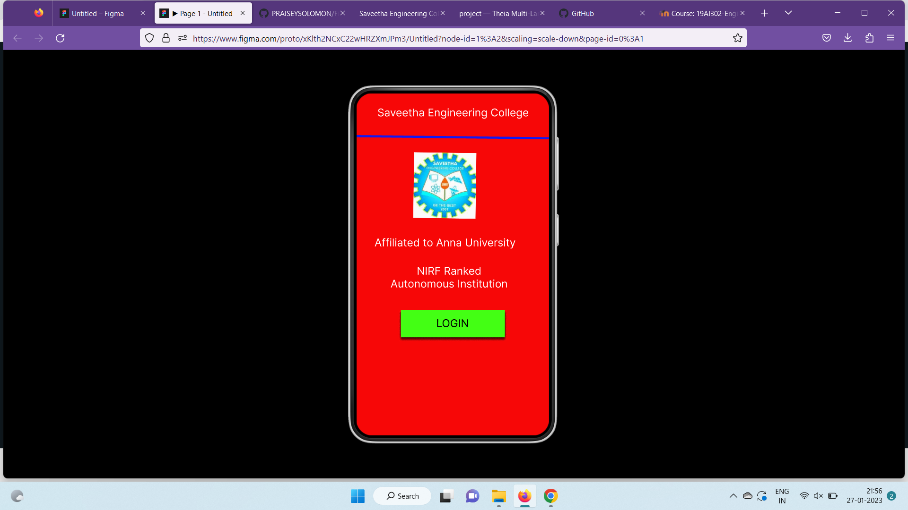
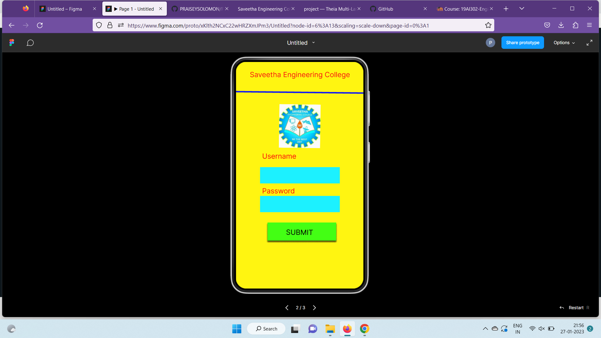
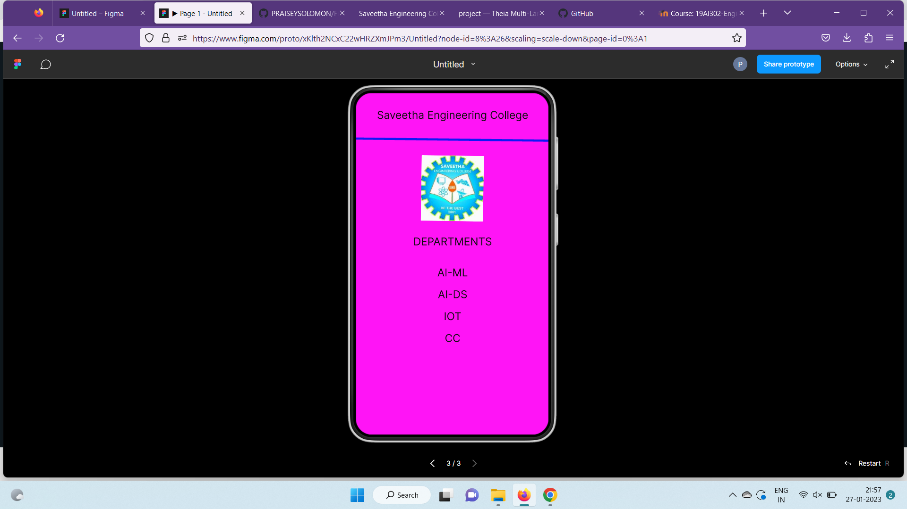

# Event Registration Web Application

## AIM:
To design, develop and deploy a web application for event registration.

## DESIGN STEPS:

### Step 1:
Create a new frame.

### Step 2:
Select any one preset size of your choice.

### Step 3:
Select the shapes you need.

### Step 4:
Import images as needed.

### Step 5:
Create pages based on your need and link them.

### Step 6:

Validate the HTML and CSS code.

### Step 6:

Publish the website in the given URL.

## DESIGN TOOL:
Figma

## code:
```

/* Home Page */
position: relative;
width: 360px;
height: 640px;
background: #F70707;

/* Login Page */
position: relative;
width: 360px;
height: 640px;
background: #FFF511;

/* Saveetha Engineering College */
position: absolute;
width: 319px;
height: 41px;
left: 21px;
top: 29px;
font-family: 'Inter';
font-style: normal;
font-weight: 400;
font-size: 20px;
line-height: 24px;
text-align: center;
color: #0E0D0D;

/* DEPARTMENTS */
position: absolute;
width: 319px;
height: 41px;
left: 21px;
top: 266px;
font-family: 'Inter';
font-style: normal;
font-weight: 400;
font-size: 20px;
line-height: 24px;
text-align: center;
color: #0E0D0D;

/* AI-ML */
position: absolute;
width: 319px;
height: 41px;
left: 21px;
top: 324px;
font-family: 'Inter';
font-style: normal;
font-weight: 400;
font-size: 20px;
line-height: 24px;
text-align: center;
color: #0E0D0D;

/* AI-DS */
position: absolute;
width: 319px;
height: 41px;
left: 21px;
top: 365px;
font-family: 'Inter';
font-style: normal;
font-weight: 400;
font-size: 20px;
line-height: 24px;
text-align: center;
color: #0E0D0D;

/* IOT */
position: absolute;
width: 319px;
height: 41px;
left: 21px;
top: 406px;
font-family: 'Inter';
font-style: normal;
font-weight: 400;
font-size: 20px;
line-height: 24px;
text-align: center;
color: #0E0D0D;

/* CC */
position: absolute;
width: 319px;
height: 41px;
left: 21px;
top: 447px;
font-family: 'Inter';
font-style: normal;
font-weight: 400;
font-size: 20px;
line-height: 24px;
text-align: center;
color: #0E0D0D;

/* Line 3 */
position: absolute;
width: 360.02px;
height: 0px;
left: 0px;
top: 87px;
border: 4px solid #0F18F6;
transform: rotate(0.64deg);

/* logo 3 */
position: absolute;
width: 116.25px;
height: 122.89px;
left: 122.77px;
top: 116px;
background: url(logo.jpg);
transform: rotate(0.82deg);
```

## OUTPUT:




## RESULT:
The program to design, develop and deploy a web application for event registration is completed successfully.